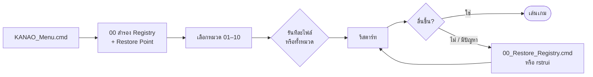

# 🎮 KANAO Gaming Optimization Scripts

[](https://github.com/adisorn6302565/KANAO-Gaming-Optimization-Scripts/actions/workflows/release.yml)


ชุดสคริปต์ `.cmd` 100 ไฟล์ใน 10 หมวด สำหรับปรับ Windows ให้เล่นเกมลื่นขึ้น ลด input lag และลด ping มี **เมนูรวม**, **ขอสิทธิ์ Admin อัตโนมัติ** และ **สำรอง/คืนค่า** ในชุด

> ⚠️ หมวด 06 และ 09 (ปิด Windows Update / Defender / Spectre mitigation / SmartScreen) **ลดความปลอดภัยของเครื่อง** ใช้เฉพาะเมื่อเข้าใจผลกระทบ และสำรองข้อมูลก่อนเสมอ

---

## 📥 ติดตั้ง

1. ดาวน์โหลด **`KANAO-Gaming-Scripts.zip`** จาก [**Releases ล่าสุด**](../../releases/latest)
   (หรือกด **Code → Download ZIP**)
2. คลิกขวา → **Extract All** ไปที่ไหนก็ได้ (ไม่ต้องติดตั้ง)
3. ดับเบิลคลิก **`KANAO_Menu.cmd`** → กด **Yes** ที่ UAC

## 🚀 วิธีใช้



- ทุกไฟล์ดับเบิลคลิกรันเดี่ยวได้ จะขอสิทธิ์ Admin เอง
- ไฟล์สำรองอยู่ที่ `C:\ProgramData\KANAO-Gaming-Scripts\backup-<วันเวลา>`
- **แนะนำเริ่มจาก:** 01, 02, 04, 07 (ปลอดภัยและเห็นผลชัด) แล้วค่อยพิจารณาหมวดอื่น

## 📁 โครงสร้าง

```text
KANAO-Gaming-Scripts/
├── KANAO_Menu.cmd                      # เมนูรวม
├── 00_Backup_Restore/                  # สำรอง / คืนค่า
├── 01_Game_Resource_Allocation/        (1-10)
├── 02_Network_Ping_Optimization/       (11-20)
├── 03_GPU_Graphics_Performance/        (21-30)
├── 04_Input_Lag_Responsiveness/        (31-40)
├── 05_File_System_Disk_Optimization/   (41-50)
├── 06_Disable_Unnecessary_Services/    (51-60)  ⚠️
├── 07_Gaming_Power_Plan/               (61-70)
├── 08_Visual_Effects_UI_Tweaks/        (71-80)
├── 09_Security_vs_Performance/         (81-90)  ⚠️
└── 10_General_System_Maintenance/      (91-100)
```

## 📚 รายละเอียดหมวดหมู่

### 🎯 หมวดที่ 1: การจัดสรรทรัพยากรสำหรับเกม (Game Resource Allocation)
| ไฟล์ | ชื่อไฟล์ | คำอธิบาย |
|------|----------|-----------|
| 01 | CPU_Priority_for_Games.cmd | เพิ่มความสำคัญ CPU ให้เกม |
| 02 | GPU_Priority_for_Games.cmd | เพิ่มความสำคัญ GPU ให้เกม |
| 03 | Network_Throttling_for_Games.cmd | จัดลำดับความสำคัญ Network |
| 04 | Disable_Network_Bandwidth_Throttling.cmd | ปิดการจำกัดแบนด์วิดท์ |
| 05 | Increase_IO_Page_Lock_Limit.cmd | เพิ่มขนาด I/O Page Lock |
| 06 | System_Responsiveness.cmd | ปรับปรุงการตอบสนองระบบ |
| 07 | Disable_Power_Throttling.cmd | ปิด Power Throttling |
| 08 | Large_System_Cache.cmd | จัดสรรหน่วยความจำ |
| 09 | Disable_Background_Apps.cmd | ปิด Background Apps |
| 10 | Memory_Management_Optimization.cmd | ปรับปรุงการจัดการหน่วยความจำ |

### 🌐 หมวดที่ 2: การปรับแต่ง Network และลด Ping (Network & Ping Optimization)
| ไฟล์ | ชื่อไฟล์ | คำอธิบาย |
|------|----------|-----------|
| 11 | Disable_Nagle_Algorithm_TCPNoDelay.cmd | ปิด Nagle's Algorithm |
| 12 | TCP_Ack_Frequency.cmd | ปรับค่า TCP Ack Frequency |
| 13 | Enable_Network_on_Chip.cmd | เปิดใช้งาน Network-on-Chip |
| 14 | TCP_Receive_Window_Size.cmd | ปรับขนาด TCP Receive Window |
| 15 | Disable_Receive_Segment_Coalescing.cmd | ปิด Receive Segment Coalescing |
| 16 | DNS_Cache_Optimization.cmd | เพิ่มประสิทธิภาพ DNS Cache |
| 17 | Default_TTL_Value.cmd | ปรับค่า Time-to-Live |
| 18 | Disable_Large_Send_Offload.cmd | ปิด Large Send Offload |
| 19 | QoS_Optimization.cmd | ปรับแต่ง Quality of Service |
| 20 | Disable_Windows_Auto_Tuning.cmd | ปิด Windows Auto-Tuning |

### 🎨 หมวดที่ 3: การเพิ่มประสิทธิภาพของ GPU และกราฟิก (GPU & Graphics Performance)
| ไฟล์ | ชื่อไฟล์ | คำอธิบาย |
|------|----------|-----------|
| 21 | Disable_VSync.cmd | ปิด V-Sync |
| 22 | Enable_Hardware_Accelerated_GPU_Scheduling.cmd | เปิด Hardware-Accelerated GPU Scheduling |
| 23 | DirectX_Performance_Tweaks.cmd | ปรับปรุง DirectX |
| 24 | GPU_Maximum_Performance_Power_Plan.cmd | ตั้งค่า GPU Power Plan |
| 25 | Disable_Shader_Cache.cmd | ปิด Shader Cache |
| 26 | Adjust_Flip_Queue_Size.cmd | ปรับ Flip Queue Size |
| 27 | Enable_Resizable_BAR.cmd | เปิด Resizable BAR |
| 28 | Anisotropic_Filtering_Settings.cmd | ตั้งค่า Anisotropic Filtering |
| 29 | Anti_Aliasing_Settings.cmd | ตั้งค่า Anti-Aliasing |
| 30 | Disable_GPU_Power_Saving.cmd | ปิด GPU Power Saving |

### ⚡ หมวดที่ 4: การลด Input Lag และเพิ่มการตอบสนอง (Input Lag & Responsiveness)
| ไฟล์ | ชื่อไฟล์ | คำอธิบาย |
|------|----------|-----------|
| 31 | Disable_Mouse_Acceleration.cmd | ปิด Mouse Acceleration |
| 32 | Mouse_Polling_Rate.cmd | ปรับ Mouse Polling Rate |
| 33 | Disable_Game_DVR_and_Game_Bar.cmd | ปิด Game DVR และ Game Bar |
| 34 | Keyboard_Responsiveness.cmd | ปรับปรุงการตอบสนองคีย์บอร์ด |
| 35 | Disable_Fullscreen_Optimizations.cmd | ปิด Fullscreen Optimizations |
| 36 | Reduce_DWM_Latency.cmd | ลดความหน่วงของ DWM |
| 37 | USB_Port_Latency_Tolerance.cmd | ปรับ USB Latency Tolerance |
| 38 | Disable_Sticky_Keys_Filter_Keys.cmd | ปิด Sticky Keys และ Filter Keys |
| 39 | System_Timer_Resolution.cmd | ปรับ Timer Resolution |
| 40 | Disable_Touchpad_When_Mouse_Connected.cmd | ปิด Touchpad เมื่อต่อเมาส์ |

### 💾 หมวดที่ 5: การปรับแต่งระบบไฟล์และดิสก์ (File System & Disk Optimization)
| ไฟล์ | ชื่อไฟล์ | คำอธิบาย |
|------|----------|-----------|
| 41 | Disable_Last_Access_Time.cmd | ปิด Last Access Time |
| 42 | Disable_Indexing.cmd | ปิด Indexing |
| 43 | NTFS_Performance_Tweaks.cmd | ปรับปรุง NTFS |
| 44 | Disable_8dot3_Short_Name.cmd | ปิด 8.3 Short Name |
| 45 | Enable_TRIM_for_SSD.cmd | เปิด TRIM สำหรับ SSD |
| 46 | Increase_MFT_Size.cmd | เพิ่มขนาด MFT |
| 47 | Cache_Manager_Optimization.cmd | ปรับปรุง Cache Manager |
| 48 | Disable_File_Compression.cmd | ปิด File Compression |
| 49 | Disable_Low_Disk_Space_Checks.cmd | ปิด Low Disk Space Checks |
| 50 | Disable_Superfetch_SysMain.cmd | ปิด Superfetch/SysMain |

### 🔧 หมวดที่ 6: การปิด Services และ Processes ที่ไม่จำเป็น (Disabling Unnecessary Services)
| ไฟล์ | ชื่อไฟล์ | คำอธิบาย |
|------|----------|-----------|
| 51 | Disable_Windows_Search.cmd | ปิด Windows Search |
| 52 | Disable_Windows_Update.cmd | ปิด Windows Update (ชั่วคราว) |
| 53 | Disable_DiagTrack.cmd | ปิด DiagTrack |
| 54 | Disable_Print_Spooler.cmd | ปิด Print Spooler |
| 55 | Disable_Fax_Service.cmd | ปิด Fax Service |
| 56 | Disable_Geolocation.cmd | ปิด Geolocation |
| 57 | Disable_Remote_Registry.cmd | ปิด Remote Registry |
| 58 | Disable_Program_Compatibility_Assistant.cmd | ปิด Program Compatibility Assistant |
| 59 | Disable_Xbox_Services.cmd | ปิด Xbox Services |
| 60 | Disable_Touch_Keyboard_Service.cmd | ปิด Touch Keyboard Service |

### 🔋 หมวดที่ 7: การปรับแต่ง Power Plan สำหรับการเล่นเกม (Gaming Power Plan)
| ไฟล์ | ชื่อไฟล์ | คำอธิบาย |
|------|----------|-----------|
| 61 | Create_Custom_Gaming_Power_Plan.cmd | สร้าง Gaming Power Plan |
| 62 | Set_Minimum_Processor_State_100.cmd | ตั้งค่า Minimum Processor State |
| 63 | Set_Maximum_Processor_State_100.cmd | ตั้งค่า Maximum Processor State |
| 64 | Disable_PCI_Express_Link_State_Power_Management.cmd | ปิด PCI Express Power Management |
| 65 | Set_Hard_Disk_Turn_Off_Never.cmd | ตั้งค่า Hard Disk Turn Off |
| 66 | Set_Wireless_Adapter_Maximum_Performance.cmd | ตั้งค่า Wireless Adapter |
| 67 | Disable_USB_Selective_Suspend.cmd | ปิด USB Selective Suspend |
| 68 | Configure_Processor_Power_Management.cmd | ปรับ Processor Power Management |
| 69 | Set_Display_Turn_Off_Never.cmd | ตั้งค่า Display Turn Off |
| 70 | Set_Sleep_Never.cmd | ตั้งค่า Sleep |

### 🎭 หมวดที่ 8: การปรับแต่งหน้าตาและลด Visual Effects (Visual Effects & UI Tweaks)
| ไฟล์ | ชื่อไฟล์ | คำอธิบาย |
|------|----------|-----------|
| 71 | Disable_All_Visual_Effects.cmd | ปิด Visual Effects ทั้งหมด |
| 72 | Disable_Transparency_Effects.cmd | ปิด Transparency Effects |
| 73 | Disable_Animation_Effects.cmd | ปิด Animation Effects |
| 74 | Disable_Action_Center_Notifications.cmd | ปิด Action Center |
| 75 | Disable_Timeline.cmd | ปิด Timeline |
| 76 | Remove_Shortcut_Arrow.cmd | ลบ Shortcut Arrow |
| 77 | Reduce_Menu_Show_Delay.cmd | ลด Menu Show Delay |
| 78 | Disable_Aero_Shake.cmd | ปิด Aero Shake |
| 79 | Disable_Aero_Peek.cmd | ปิด Aero Peek |
| 80 | Disable_Lock_Screen.cmd | ปิด Lock Screen |

### 🛡️ หมวดที่ 9: การปรับแต่งความปลอดภัยเพื่อเพิ่มประสิทธิภาพ (Security vs. Performance)
| ไฟล์ | ชื่อไฟล์ | คำอธิบาย |
|------|----------|-----------|
| 81 | Disable_Windows_Defender.cmd | ปิด Windows Defender ⚠️ |
| 82 | Add_Antivirus_Exclusions.cmd | เพิ่มข้อยกเว้น Antivirus |
| 83 | Disable_Spectre_Meltdown_Mitigations.cmd | ปิด Spectre/Meltdown ⚠️ |
| 84 | Adjust_UAC_Settings.cmd | ปรับ UAC |
| 85 | Disable_SmartScreen_Filter.cmd | ปิด SmartScreen |
| 86 | Disable_Memory_Integrity.cmd | ปิด Memory Integrity ⚠️ |
| 87 | Configure_Firewall_for_Games.cmd | ปรับแต่ง Firewall |
| 88 | Disable_App_Browser_Control.cmd | ปิด App & Browser Control |
| 89 | Disable_Controlled_Folder_Access.cmd | ปิด Controlled Folder Access |
| 90 | Disable_Exploit_Protection_for_Games.cmd | ปิด Exploit Protection |

### 🧹 หมวดที่ 10: การปรับแต่งทั่วไปและการดูแลรักษาระบบ (General System & Maintenance)
| ไฟล์ | ชื่อไฟล์ | คำอธิบาย |
|------|----------|-----------|
| 91 | Disable_Automatic_Maintenance.cmd | ปิด Automatic Maintenance |
| 92 | Disable_Error_Reporting.cmd | ปิด Error Reporting |
| 93 | Clear_Temp_Files_on_Shutdown.cmd | ล้าง Temp Files |
| 94 | Disable_Startup_Delay.cmd | ปิด Startup Delay |
| 95 | Disable_Auto_Reboot_After_Update.cmd | ปิด Auto-Reboot |
| 96 | Increase_Shutdown_Speed.cmd | เพิ่มความเร็ว Shutdown |
| 97 | Disable_AutoPlay.cmd | ปิด AutoPlay |
| 98 | Clear_Pagefile_on_Shutdown.cmd | ล้าง Pagefile |
| 99 | Disable_Customer_Experience_Improvement_Program.cmd | ปิด CEIP |
| 100 | Optimize_Pagefile_Size.cmd | ปรับแต่ง Pagefile |

## 🔄 คืนค่า

1. รัน `00_Backup_Restore\00_Restore_Registry.cmd` (ใช้ชุดสำรองล่าสุด) แล้วรีสตาร์ท
2. ถ้ายังไม่หาย: `Win + R` → `rstrui` → เลือก Restore Point **"KANAO Gaming Scripts"**
3. Services ที่ถูกปิด (หมวด 06) เปิดกลับเองได้ที่ `services.msc` → ตั้ง Startup type เป็น Automatic/Manual

## 🆕 v2.0

| เดิม | ใหม่ |
|---|---|
| ภาษาไทยเป็นตัวอักษรเพี้ยนใน cmd (ไฟล์ UTF-8 แต่ไม่ได้ตั้ง code page) | ทุกไฟล์ใช้ `chcp 65001` |
| 28 ไฟล์ไม่ตรวจสิทธิ์ Admin → รันแล้วขึ้นว่าสำเร็จ แต่ค่า HKLM ไม่เปลี่ยน | ทุกไฟล์ขอสิทธิ์ Admin อัตโนมัติ (UAC) |
| ต้องคลิกขวา Run as administrator ทีละไฟล์ | `KANAO_Menu.cmd` เลือกหมวด / รันทั้งหมวดได้ |
| ให้ผู้ใช้สำรอง Registry เอง | `00_Backup_Restore` สำรอง + Restore Point + คืนค่า |
| — | ZIP พร้อมใช้ในหน้า Releases (สร้างอัตโนมัติ) |

## 📜 ใบอนุญาต

ใช้งานได้อิสระ ผู้ใช้รับผิดชอบผลจากการใช้งานเอง
